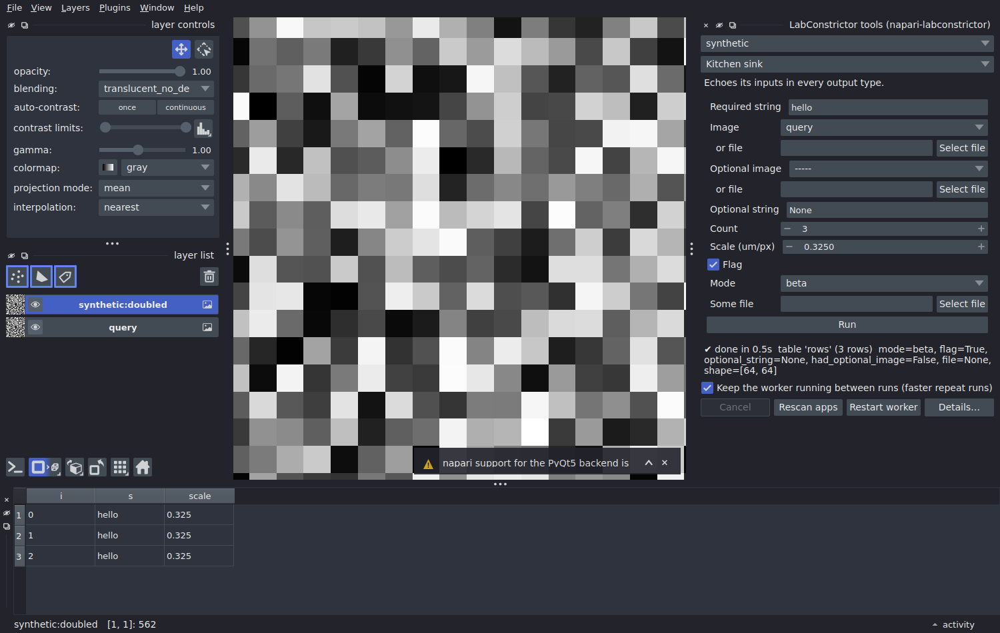

# LabConstrictor for Napari

**Run registered Python analysis tools from Napari.**

Choose an image layer, select an analysis tool and run it. Results come back as Napari layers, tables or messages. The analysis itself runs in the application's own Python environment, so you do not need to install its scientific dependencies into Napari.

The plugin provides **one dock widget for all registered LabConstrictor applications**. It builds the controls from each tool's Python declaration.



## First run: Playground

Install [LabConstrictor Playground](https://github.com/CellMigrationLab/LabConstrictor-Playground) to test the widget without scientific data. Install it, open the LabConstrictor widget and select **Feature tour**.

You can leave its image input unset: the tool makes a small demonstration image with blobs and rings. It returns a label image, outlines, points, a measurements table and a summary. Try changing the threshold to see how a second run updates results marked for replacement.

Playground is a test application, not a substitute for a validated scientific analysis. Once you have an application such as NucleiSky or CellTracksColab installed and registered, its declared tools appear in the same widget.

## Use it with your own data

1. Open an image in Napari, or prepare a TIFF/OME-TIFF file.
2. Choose **Plugins > LabConstrictor tools**.
3. Select the registered application and the tool.
4. Choose a layer or file for each image input. If both are set, **the file wins**.
5. Set the parameters and run. Watch the progress and inspect the results in Napari.

The widget supports the controls a tool declares: numbers with ranges and units, choices, files, folders and optional parameters. Advanced settings can be hidden until needed. Where supported, dependent controls are disabled when they do not apply.

### Selections, channels and calibration

- **Use a selection:** a tool with a `RegionOf(...)` input can use a selected Shapes layer as a labelled region. This is tool-specific; it does not crop every analysis automatically.
- **Pick a channel:** a tool with `PickChannel()` can receive a selected channel from an RGB layer or a multichannel file.
- **Use physical units:** pixel-size inputs can follow a layer's scale or a TIFF's metadata. Check calibration before relying on measurements.

## Results

| Tool result | In Napari |
|---|---|
| Image or labels | Image or Labels layer |
| Points or outlines | Points or Shapes layer |
| Table | Table dock |
| Alignment | Transformed or affine-positioned layer |
| Message or values | Status/result display |
| File | File path/result information |

A tool can request that repeated runs replace earlier results rather than create more layers. Long-running tools can report progress and respond to **Cancel**; a worker that ignores cancellation is stopped after a grace period.

If a tool reports that nothing matched, the widget treats that as a notice rather than an unexpected crash.

## Install

In the Python environment used by Napari (**Python 3.10 or newer**):

```bash
python -m pip install https://github.com/CellMigrationLab/LabConstrictor-Tools/archive/refs/heads/main.zip
python -m pip install https://github.com/CellMigrationLab/napari-labconstrictor/archive/refs/heads/main.zip
```

Then start Napari and choose **Plugins > LabConstrictor tools**.

You must also install the LabConstrictor application whose tools you want to run. Its installer normally registers it. If nothing appears, inspect the registry:

```bash
labconstrictor-tools list
labconstrictor-tools doctor
```

The widget reads cached tool descriptions, then runs each tool through the Toolkit worker in that application's own interpreter.

## Reproduce a run and diagnose failures

The widget can copy the last run as a terminal command or Python snippet. When an input came from an unsaved layer, save the data before expecting that command to reproduce the run from disk.

Failures appear in the widget; **Details** includes worker output and the log tail. The shared log is `~/.labconstrictor/logs/labconstrictor.log` by default, and run records are kept under `~/.labconstrictor/runs/`. Use `labconstrictor-tools support-bundle` to collect diagnostics for an issue.

## Current status

**Testing phase.** The plugin has been tested on Linux with Napari 0.9 and a virtual display. Native Windows and macOS testing remains to be done. The [human test protocol](https://github.com/CellMigrationLab/LabConstrictor-Tools/blob/main/docs/HUMAN_TEST_PROTOCOL.md) explains how to help.

Not every host supports every LabConstrictor presentation hint in the same way. This README describes the Napari implementation, not a guarantee about Fiji or QuPath.

For more detail, see [Napari inputs and results](docs/USING_NAPARI.md).

## Applications

[Playground](https://github.com/CellMigrationLab/LabConstrictor-Playground) provides a small first run. [Guess the Condition](https://github.com/CellMigrationLab/GuessTheCondition) offers blinded microscopy-image classification, and [VLab4Mic](https://github.com/CellMigrationLab/LabConstrictor-VLab4Mic) simulates fluorescence images; both document Napari bridge workflows.

See the [Toolkit application list](https://github.com/CellMigrationLab/LabConstrictor-Tools#applications) for [NucleiSky](https://github.com/CellMigrationLab/NucleiSky), [CellTracksColab](https://github.com/CellMigrationLab/CellTracksColab_LabConstrictor) and installer links. Only tools registered by the installed application appear in the widget.

## Development

The widget lives in `napari_labconstrictor/_widget.py`, with schema conversion in `_schema.py`, result presentation in `_results.py`, layer/file export in `_export.py` and worker management in `_workers.py`.

Install the development dependencies and run the focused tests from `tests/`:

```bash
python -m pip install -e ".[test]"
cd tests
python test_units.py
xvfb-run -a python test_widget.py
xvfb-run -a python test_interactions.py
xvfb-run -a python test_region.py
xvfb-run -a python test_messages_points.py
```

Other tests cover channels, file sources, calibration, cancellation, result limits, forms and failures. Most use the Toolkit's synthetic example application rather than real scientific packages.

Related projects: [Toolkit](https://github.com/CellMigrationLab/LabConstrictor-Tools) · [Fiji](https://github.com/CellMigrationLab/LabConstrictor-Fiji) · [QuPath](https://github.com/CellMigrationLab/LabConstrictor-QuPath) · [Playground](https://github.com/CellMigrationLab/LabConstrictor-Playground).

License: MIT.
